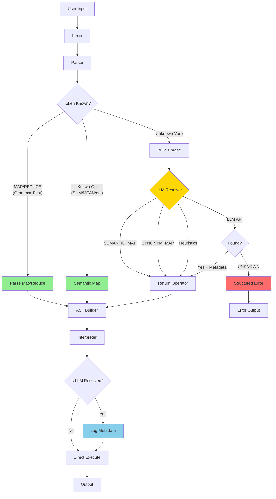

# SpeakMath: Natural Expressions into Verified Computations


**SpeakMath** is a math-focused natural language mini-programming language that interprets expressions like _"find the mean of these values"_ into verified computations. The LLM suggests operator meanings, while our grammar verifies expressions before evaluation.

**University of Malaya** | Faculty of Computer Science & Information Technology  
**WIF3010: Programming Language Concepts** | Project Brief 2025

---

## 📖 Table of Contents

- [About the Project](#-about-the-project)
- [System Architecture](#-system-architecture)
- [Grammar Design (Week 8)](#-grammar-design-week-8)
- [Team Roles](#-team-roles)
- [Current Progress](#-current-progress)
- [Next Steps](#-next-steps)

---

## 🤖 About the Project

**Project Title:** SpeakMath (Topic #3 from WIF3010 Brief)

**Core Concept:**  
Create a math-focused natural mini-language where:

- Users write commands like _"find the mean of these values"_
- LLM suggests operator meanings (e.g., "average" → `mean`)
- Our grammar verifies expressions before evaluation
- Execution is handled by our own interpreter

**Paradigm Extension:** Functional Programming (map/reduce/composition)

### Why SpeakMath?

- Makes mathematical operations accessible through natural language
- Combines formal grammar verification with LLM flexibility
- Perfect for demonstrating functional programming concepts
- Clear scope for proof of correctness

---

## 🏗 System Architecture

### Updated Architecture with LLM Fallback



**Legend:**

- 🟢 **Green:** Grammar-First (No LLM)
- 🟡 **Yellow:** LLM Fallback Layer
- 🔴 **Red:** Error Handling
- 🔵 **Blue:** Metadata Logging

**Flow Summary:**

1. **Lexer:** Tokenizes input (MAP/REDUCE = keywords)
2. **Parser:** Matches grammar or builds phrase for unknown verbs
3. **LLM Resolver:** 4-layer strategy (Map→Synonym→Heuristic→API)
4. **AST Builder:** Creates nodes with LLM metadata
5. **Interpreter:** Executes and logs LLM resolutions

**See:** [Complete Architecture Diagram](docs/architecture_diagram.md)

---

## 🎯 LLM Integration Rules

### ✅ LLM CAN:

- Map unknown verb phrases to canonical operators
- Provide reasoning for operator choices
- Return "UNKNOWN" for unsupported operations
- Resolve operation names within map/reduce

### ❌ LLM CANNOT:

- Override grammar rules
- Change token types or syntax structure
- Generate AST nodes
- Handle MAP/REDUCE keywords (always grammar-first)
- Execute code

**See:** [LLM Fallback Design](docs/llm_fallback_design.md#3-llm-intervention-rules)

---

## 📜 Grammar Design (Week 8)

### Syntax Definition

The formal BNF/EBNF syntax definition has been moved to [docs/syntax_definition.md](docs/syntax_definition.md).

**Implemented Extensions:**

- ✅ Variable assignment: `set x to 5`
- ✅ Conditionals: `if x > 10 then print x`
- ✅ Functional ops: `map add 2 over [1, 2, 3]`

### LLM Fallback System

**NEW:** SpeakMath now includes a sophisticated LLM fallback system that supplements the grammar without overriding it.

**Key Features:**

- 🎯 **Grammar-First:** MAP/REDUCE and known operations always use grammar
- 🤖 **LLM Supplement:** Unknown verbs resolved via AI (e.g., "tally up" → sum)
- 📊 **Structured Errors:** Detailed failure objects with suggestions
- 📝 **Metadata Tracking:** All LLM resolutions logged with reasoning

**Documentation:**

- 📘 [LLM Fallback Design](docs/llm_fallback_design.md) - Complete design document
- 📊 [Architecture Diagram](docs/architecture_diagram.md) - System flow diagrams
- ⚡ [Quick Reference](docs/quick_reference.md) - Fast lookup guide
- 📋 [Implementation Summary](docs/IMPLEMENTATION_SUMMARY.md) - Task completion summary

**Example:**

```python
# Grammar-First (No LLM):
Input: "sum [1, 2, 3]"
Output: 6

# LLM Fallback (AI Resolves Unknown Verb):
Input: "tally up [1, 2, 3]"
LLM: "tally up" → OP_SUM (Reasoning: "tally implies summation")
Output: 6 (with log: "ℹ️ LLM Resolution: 'tally up' → SUM")

# Grammar-First Guarantee (MAP always parsed by grammar):
Input: "map add 2 over [1, 2, 3]"
Grammar: Handles structure, LLM only resolves "add" if needed
Output: [3, 4, 5]
```

### Example Commands

```
sum 1, 2, 3, 4, 5
mean 10, 20, 30, 40
multiply 5 and 6
tally up [10, 20, 30]        # LLM-resolved
map increment 2 over [1,2,3]  # Grammar-first structure
reduce product on [2,3,4]     # Grammar-first
```

### Sample Parse Tree (Week 8 Deliverable)

```
Command: "sum 1, 2, 3"

    <command>
        |
    ____|____
   |         |
<operation> <expression>
   |            |
  "sum"    1, 2, 3
```

---

## 👥 Team Roles

| Role                             | Name          | Responsibilities                        |
| -------------------------------- | ------------- | --------------------------------------- |
| **Language Architect**           | [Insert Name] | Design BNF/EBNF grammar, parse trees    |
| **Programmer/Integrator**        | [Insert Name] | Build lexer/parser, system integration  |
| **Semantics & Proof Specialist** | [Insert Name] | Semantic mapping, correctness proofs    |
| **LLM Integration Engineer**     | [Insert Name] | LLM API integration, synonym resolution |
| **Runtime & Execution Engineer** | [Insert Name] | Execution engine, functional paradigm   |

---

## 📅 Current Progress

### Week 5 ✅

- [x] Team formation
- [x] Project proposal submitted
- [x] Group contract signed
- [x] Selected "SpeakMath" as project title

### Week 8 � (Completed)

- [x] Finalize BNF/EBNF grammar
- [x] Create sample parse trees
- [x] Design semantic mapping table
- [x] **Implement LLM fallback system**
- [x] **Create comprehensive architecture diagrams**
- [x] **Deliverable 2:** Presentation 1 (Grammar + Architecture)

### Week 8+ (NEW: LLM Integration)

- [x] Implement structured failure objects
- [x] Update AST with LLM-resolved nodes
- [x] Create grammar-first enforcement tests
- [x] Document LLM intervention rules
- [x] Build 4-layer resolution strategy

---

## 🎯 Next Steps

### Immediate (Week 8)

1. Complete formal grammar definition
2. Design 3-5 parse tree examples
3. Create high-level architecture diagram
4. Prepare Presentation 1

### Week 8 (After Presentation)

1. Start implementing lexer
2. Build basic parser
3. Test with simple commands

### Week 10

1. Integrate LLM API
2. Implement functional features (map/reduce)
3. Prepare Presentation 2

---

## 📊 Assessment Focus

| Criteria                        | Marks | Current Status |
| ------------------------------- | ----- | -------------- |
| Proposal & Grammar Design       | 15    | 🟡 In Progress |
| Parser & Interpreter            | 20    | ⏳ Pending     |
| LLM Integration                 | 15    | ⏳ Pending     |
| Paradigm Extension (Functional) | 10    | ⏳ Pending     |
| Proof of Correctness            | 10    | ⏳ Pending     |
| Testing & Evaluation            | 10    | ⏳ Pending     |
| Presentations                   | 10    | 🟡 Preparing   |
| Final Report                    | 10    | ⏳ Pending     |

---

## 📚 Quick References

**Required for Week 8:**

- BNF/EBNF grammar specification
- 3-5 example parse trees
- High-level system architecture
- Semantic mapping plan
- LLM integration strategy

**Tools We'll Use:**

- Python 3.8+ (interpreter)
- OpenAI API or Gemini (LLM layer)
- PLY or recursive-descent parser
- GitHub (collaboration)

---

**University of Malaya** | FCSIT  
**Last Updated:** Week 8, 2025
