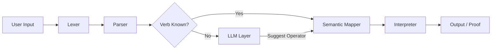

# SpeakMath: Natural Expressions into Verified Computations


**SpeakMath** is a mini programming language designed to interpret natural language commands for mathematical computations. It combines a formal grammar for strict verification with a Large Language Model (LLM) for handling ambiguity, focusing on **Functional Programming** concepts like `map`, `reduce`, and `composition`.

---

## 📖 Table of Contents

- [About the Project](#-about-the-project)
- [System Architecture](#-system-architecture)
- [Grammar and Syntax](#-grammar-and-syntax)
- [LLM Integration Strategy](#-llm-integration-strategy)
- [Installation and Usage](#-installation-and-usage)
- [Project Roadmap](#-project-roadmap)
- [The Team](#-the-team)

---

## 🤖 About the Project

This project is part of the **WIF3010: Project Brief 2025**. The goal is to design an **LLM-Assisted Natural Language Programming Language (NLPL)**.

**SpeakMath** allows users to input commands like *"sum these numbers"* or *"map add 2 over list"*.

* **Core:** A custom-built interpreter using a recursive-descent parser.
* **Helper:** An LLM (OpenAI/Gemini) is used *only* to resolve synonyms (e.g., "average" → `mean`) but does **not** write the code.
* **Extension:** Implements Functional Programming paradigms (Map/Reduce).

---

## 🏗 System Architecture

The system follows a strict pipeline to ensure the LLM is not a "black box."


**Lexer:** Tokenizes input (variables, numbers, keywords).  
**Parser:** Builds an Abstract Syntax Tree (AST) based on strict EBNF grammar.  
**Semantic Mapper:** Validates verbs against a symbol table.  
**LLM Layer:** Resolves unknown verbs to canonical operators (e.g., "accumulate" → `OP_REDUCE`).  
**Interpreter:** Executes the logic mathematically.

---

## 📜 Grammar and Syntax

SpeakMath uses a formal Context-Free Grammar.

### Basic Computation:
```ebnf
<command> ::= <operation> <expression>
<operation> ::= "sum" | "mean" | "multiply" | "sort ascending"
```

### Functional Commands (Advanced Paradigm):
```ebnf
<functional> ::= "map" <function>? "over" <list>
               | "reduce" <operator> "over" <list>
<composition> ::= <function> "then" <function>
```

### Examples:
```
sum 1, 2, 3
set x to 10 + 5
map add 5 over [1, 2, 3]
if x > 10 then print x
```

---

## 🧠 LLM Integration Strategy

The LLM is strictly a **Semantic Helper**. It does not execute code.

| User Input | Grammar Check | LLM Action | Canonical Op |
|------------|---------------|------------|--------------|
| "calculate mean of..." | Found in Grammar | None | `OP_MEAN` |
| "find the average..." | Not Found | Maps "average" → "mean" | `OP_MEAN` |
| "accumulate values..." | Not Found | Maps "accumulate" → "reduce" | `OP_REDUCE` |

---

## 🚀 Installation and Usage

### Prerequisites

- Python 3.8+
- `pip install -r requirements.txt` (Coming soon)
- OpenAI API Key (for LLM layer)

### Setup
```bash
# 1. Clone the repository
git clone https://github.com/YOUR_USERNAME/SpeakMath.git

# 2. Navigate to directory
cd SpeakMath

# 3. Set up environment (Create .env file)
echo "OPENAI_API_KEY=your_key_here" > .env

# 4. Run the interpreter (Prototype)
python main.py
```

---

## 📅 Project Roadmap

| Week | Phase | Status |
|------|-------|--------|
| Wk 5 | Proposal & Contract | ✅ Completed |
| Wk 8 | Grammar & Semantics Design | 🟡 In Progress |
| Wk 8 | Core Interpreter Implementation | ⏳ Pending |
| Wk 10 | LLM Layer Integration | ⏳ Pending |
| Wk 10 | Functional Paradigm Extension | ⏳ Pending |
| Wk 12 | Testing & Proof of Correctness | ⏳ Pending |
| Wk 14 | Final Presentation & Report | ⏳ Pending |

---

## 👥 The Team

- **Project Coordinator:** [Insert Name]
- **Language Architect:** [Insert Name]
- **Semantics & Proof Specialist:** [Insert Name]
- **Programmer / Integrator:** [Insert Name]
- **Evaluation & Documentation:** [Insert Name]

---

**University of Malaya** | Faculty of Computer Science & Information Technology
