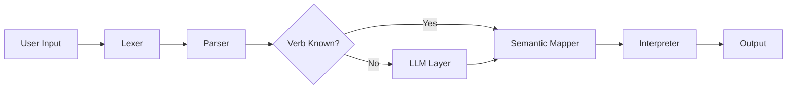

# SpeakMath: Natural Expressions into Verified Computations


**SpeakMath** is a math-focused natural language mini-programming language that interprets expressions like *"find the mean of these values"* into verified computations. The LLM suggests operator meanings, while our grammar verifies expressions before evaluation.

**University of Malaya** | Faculty of Computer Science & Information Technology  
**WIF3010: Programming Language Concepts** | Project Brief 2025

---

## 📖 Table of Contents

- [About the Project](#-about-the-project)
- [System Architecture](#-system-architecture)
- [Grammar Design (Week 8)](#-grammar-design-week-8)
- [Team Roles](#-team-roles)
- [Current Progress](#-current-progress)
- [Next Steps](#-next-steps)

---

## 🤖 About the Project

**Project Title:** SpeakMath (Topic #3 from WIF3010 Brief)

**Core Concept:**  
Create a math-focused natural mini-language where:
- Users write commands like *"find the mean of these values"*
- LLM suggests operator meanings (e.g., "average" → `mean`)
- Our grammar verifies expressions before evaluation
- Execution is handled by our own interpreter

**Paradigm Extension:** Functional Programming (map/reduce/composition)

### Why SpeakMath?

- Makes mathematical operations accessible through natural language
- Combines formal grammar verification with LLM flexibility
- Perfect for demonstrating functional programming concepts
- Clear scope for proof of correctness

---

## 🏗 System Architecture


**Current Focus (Week 8):**
- Designing the grammar (BNF/EBNF)
- Planning semantic mappings
- Sketching LLM integration approach

---

## 📜 Grammar Design (Week 8)

### Syntax Definition

The formal BNF/EBNF syntax definition has been moved to [docs/syntax_definition.md](docs/syntax_definition.md).

**Planned Extensions:**
- Variable assignment: `set x to 5`
- Conditionals: `if x > 10 then print x`
- Functional ops: `map add 2 over [1, 2, 3]`

### Example Commands
```
sum 1, 2, 3, 4, 5
mean 10, 20, 30, 40
multiply 5 and 6
```

### Sample Parse Tree (Week 8 Deliverable)
```
Command: "sum 1, 2, 3"

    <command>
        |
    ____|____
   |         |
<operation> <expression>
   |            |
  "sum"    1, 2, 3
```

---

## 👥 Team Roles

| Role | Name | Responsibilities |
|------|------|------------------|
| **Language Architect** | [Insert Name] | Design BNF/EBNF grammar, parse trees |
| **Programmer/Integrator** | [Insert Name] | Build lexer/parser, system integration |
| **Semantics & Proof Specialist** | [Insert Name] | Semantic mapping, correctness proofs |
| **LLM Integration Engineer** | [Insert Name] | LLM API integration, synonym resolution |
| **Runtime & Execution Engineer** | [Insert Name] | Execution engine, functional paradigm |

---

## 📅 Current Progress

### Week 5 ✅
- [x] Team formation
- [x] Project proposal submitted
- [x] Group contract signed
- [x] Selected "SpeakMath" as project title

### Week 8 🟡 (Current)
- [ ] Finalize BNF/EBNF grammar
- [ ] Create sample parse trees
- [ ] Design semantic mapping table
- [ ] Plan LLM integration approach
- [ ] **Deliverable 2:** Presentation 1 (Grammar + Architecture)

---

## 🎯 Next Steps

### Immediate (Week 8)
1. Complete formal grammar definition
2. Design 3-5 parse tree examples
3. Create high-level architecture diagram
4. Prepare Presentation 1

### Week 8 (After Presentation)
1. Start implementing lexer
2. Build basic parser
3. Test with simple commands

### Week 10
1. Integrate LLM API
2. Implement functional features (map/reduce)
3. Prepare Presentation 2

---

## 📊 Assessment Focus

| Criteria | Marks | Current Status |
|----------|-------|----------------|
| Proposal & Grammar Design | 15 | 🟡 In Progress |
| Parser & Interpreter | 20 | ⏳ Pending |
| LLM Integration | 15 | ⏳ Pending |
| Paradigm Extension (Functional) | 10 | ⏳ Pending |
| Proof of Correctness | 10 | ⏳ Pending |
| Testing & Evaluation | 10 | ⏳ Pending |
| Presentations | 10 | 🟡 Preparing |
| Final Report | 10 | ⏳ Pending |

---

## 📚 Quick References

**Required for Week 8:**
- BNF/EBNF grammar specification
- 3-5 example parse trees
- High-level system architecture
- Semantic mapping plan
- LLM integration strategy

**Tools We'll Use:**
- Python 3.8+ (interpreter)
- OpenAI API or Gemini (LLM layer)
- PLY or recursive-descent parser
- GitHub (collaboration)

---

**University of Malaya** | FCSIT  
**Last Updated:** Week 8, 2025
