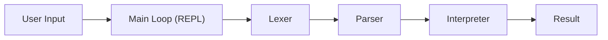
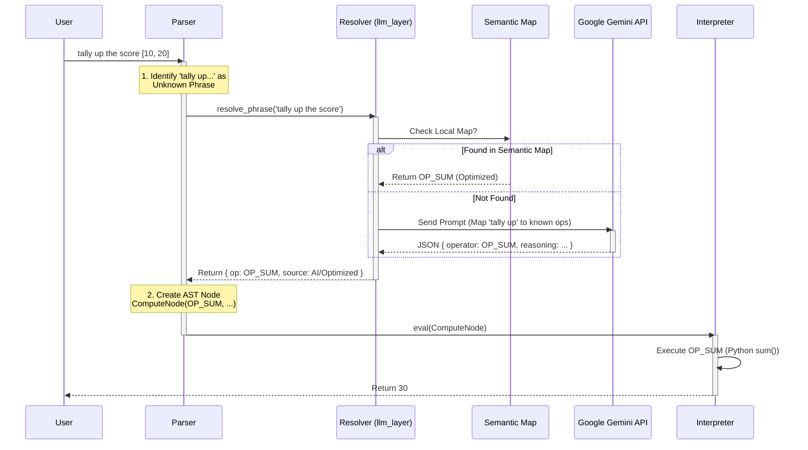

# SpeakMath: LLM Integration Code Flow

This document details the control flow for Natural Language commands in SpeakMath.

## High-Level Architecture

## Detailed Flow: Natural Language Processing

When the user enters a phrase like `"tally up the score [10, 20]"`, the system follows this path:

## Key Components

### 1. The Parser (`parser.py`)
- **Role**: The "Brain" that decides when to switch from strict grammar to AI mode.
- **Logic**: 
    - Reads token by token.
    - If it sees a "Safe Word" (like *find*, *calculate*, *the*), it keeps reading to form a full sentence.
    - Calls `resolve_phrase()` to understand the sentence.

### 2. The Resolver (`llm_layer.py`)
- **Role**: The bridge between code and AI.
- **Optimization**: First checks a `semantic_map.py` (Hash Map) for instant results.
- **Fallback**: If not found, calls Gemini to "guess" the intent based on the list of known operations (`OP_SUM`, `OP_MEAN`, etc.).

### 3. The Interpreter (`interpreter.py`)
- **Role**: Pure logic execution.
- **Design**: It doesn't know about English or AI. It only knows `OP_SUM`. This keeps the core logic safe and deterministic.
