# SpeakMath Pipeline Diagrams (Mermaid.js)

## Main Pipeline Flow

```mermaid
flowchart LR
    subgraph Input
        A[📝 User Command]
    end
    
    subgraph Processing
        B[🔤 Lexer]
        C[🌳 Parser]
        D[🌲 AST]
        E[⚙️ Interpreter]
    end
    
    subgraph Fallback
        F[🤖 LLM Fallback]
        G[📚 Semantic Map]
    end
    
    subgraph Output
        H[✅ Result]
    end
    
    A --> B
    B -->|Tokens| C
    C -->|"if ambiguous"| G
    G -->|"not found"| F
    F -->|"resolved op"| C
    G -->|"found"| C
    C -->|AST Node| D
    D --> E
    E --> H
    
    style A fill:#3b82f6,stroke:#1e40af,color:#fff
    style B fill:#1e293b,stroke:#3b82f6,color:#e2e8f0
    style C fill:#1e293b,stroke:#3b82f6,color:#e2e8f0
    style D fill:#1e293b,stroke:#3b82f6,color:#e2e8f0
    style E fill:#1e293b,stroke:#3b82f6,color:#e2e8f0
    style F fill:#7c3aed,stroke:#a855f7,color:#fff
    style G fill:#475569,stroke:#64748b,color:#e2e8f0
    style H fill:#22c55e,stroke:#16a34a,color:#fff
```



---

## Detailed Architecture

```mermaid
flowchart TB
    subgraph USER["👤 USER INTERFACE"]
        CLI[CLI/REPL]
        UI[Streamlit UI]
    end
    
    subgraph LEXER["🔤 LEXER"]
        L1[Tokenize Input]
        L2[Identify Keywords]
        L3[Extract Numbers]
        L4[Parse Operators]
    end
    
    subgraph PARSER["🌳 PARSER"]
        P1[Build AST]
        P2[Resolve Phrases]
        P3[Handle Precedence]
    end
    
    subgraph SEMANTIC["📚 SEMANTIC RESOLUTION"]
        SM[Semantic Map]
        LLM[LLM Fallback<br/>Gemini API]
    end
    
    subgraph AST["🌲 AST NODES"]
        N1[ComputeNode]
        N2[MapNode]
        N3[ReduceNode]
        N4[FilterNode]
        N5[AssignNode]
        N6[IfNode]
    end
    
    subgraph INTERPRETER["⚙️ INTERPRETER"]
        I1[Evaluate AST]
        I2[Execute Operations]
        I3[Manage Variables]
        I4[Function Composition]
    end
    
    subgraph OUTPUT["✅ OUTPUT"]
        O1[Number Result]
        O2[List Result]
        O3[Display]
    end
    
    CLI --> L1
    UI --> L1
    L1 --> L2 --> L3 --> L4
    L4 --> P1
    P1 --> P2
    P2 --> SM
    SM -->|"not found"| LLM
    LLM -->|"resolved"| P2
    SM -->|"found"| P3
    P3 --> N1 & N2 & N3 & N4 & N5 & N6
    N1 & N2 & N3 & N4 & N5 & N6 --> I1
    I1 --> I2 --> I3 --> I4
    I4 --> O1 & O2
    O1 & O2 --> O3
    
    style CLI fill:#3b82f6,stroke:#1e40af,color:#fff
    style UI fill:#3b82f6,stroke:#1e40af,color:#fff
    style LLM fill:#7c3aed,stroke:#a855f7,color:#fff
    style O3 fill:#22c55e,stroke:#16a34a,color:#fff
```



---

## Example Execution: `sum [10, 20, 30]`

```mermaid
flowchart LR
    subgraph Step1["1️⃣ INPUT"]
        A["sum [10, 20, 30]"]
    end
    
    subgraph Step2["2️⃣ LEXER"]
        B["SUM(sum)<br/>LBRACK([)<br/>NUMBER(10)<br/>COMMA(,)<br/>NUMBER(20)<br/>COMMA(,)<br/>NUMBER(30)<br/>RBRACK(])<br/>EOF()"]
    end
    
    subgraph Step3["3️⃣ PARSER"]
        C["ComputeNode<br/>op=OP_SUM"]
    end
    
    subgraph Step4["4️⃣ AST"]
        D["ComputeNode"]
        E["ListNode"]
        F["10"]
        G["20"]
        H["30"]
        D --> E
        E --> F & G & H
    end
    
    subgraph Step5["5️⃣ INTERPRETER"]
        I["sum([10,20,30])<br/>= 10+20+30"]
    end
    
    subgraph Step6["6️⃣ OUTPUT"]
        J["60"]
    end
    
    A --> B --> C --> D
    D --> I --> J
    
    style A fill:#3b82f6,stroke:#1e40af,color:#fff
    style J fill:#22c55e,stroke:#16a34a,color:#fff,font-size:20px
```



---

## Functional Composition: `map add 5 over [1,2,3] then reduce sum over _`


---

## LLM Fallback Flow


---

## AST Node Types


---

## Interpreter Dispatch Table

```mermaid
flowchart TB
    subgraph Dispatch["⚙️ INTERPRETER DISPATCH"]
        A[eval node]
        A --> B{Node Type?}
        
        B -->|NumberNode| C["Return value"]
        B -->|VariableNode| D["Lookup in vars"]
        B -->|ListNode| E["Eval each element"]
        B -->|BinaryOpNode| F["Eval left ⊕ right"]
        B -->|AssignNode| G["Store in vars"]
        B -->|ComputeNode| H["Execute operation"]
        B -->|MapNode| I["Apply to each"]
        B -->|ReduceNode| J["Aggregate list"]
        B -->|FilterNode| K["Filter by condition"]
        B -->|IfNode| L["Conditional eval"]
        B -->|SequenceNode| M["Compose functions"]
    end
    
    subgraph Operations["📊 COMPUTE OPERATIONS"]
        H --> H1["OP_SUM: sum()"]
        H --> H2["OP_MEAN: avg()"]
        H --> H3["OP_PRODUCT: prod()"]
        H --> H4["OP_MAX: max()"]
        H --> H5["OP_MIN: min()"]
        H --> H6["OP_SORT: sorted()"]
    end
    
    style A fill:#3b82f6,stroke:#1e40af,color:#fff
```



---

## Simple Linear Pipeline (For Poster)

```mermaid
flowchart LR
    A[📝 Input] --> B[🔤 Lexer] --> C[🌳 Parser] --> D[🌲 AST] --> E[⚙️ Interpreter] --> F[✅ Output]
    
    C -.->|ambiguous| G[🤖 LLM]
    G -.-> C
    
    style A fill:#3b82f6,stroke:#1e40af,color:#fff
    style B fill:#1e293b,stroke:#3b82f6,color:#e2e8f0
    style C fill:#1e293b,stroke:#3b82f6,color:#e2e8f0
    style D fill:#1e293b,stroke:#3b82f6,color:#e2e8f0
    style E fill:#1e293b,stroke:#3b82f6,color:#e2e8f0
    style F fill:#22c55e,stroke:#16a34a,color:#fff
    style G fill:#7c3aed,stroke:#a855f7,color:#fff
```



---

## Usage

### In GitHub/GitLab Markdown
These diagrams will render automatically in GitHub, GitLab, and other platforms that support Mermaid.

### In Presentations
1. Copy the Mermaid code
2. Use [Mermaid Live Editor](https://mermaid.live/) to export as PNG/SVG
3. Or use VS Code with Mermaid extension

### In Streamlit
```python
import streamlit as st
st.markdown("""

""")
```

---

*SpeakMath - Deliverable 7 Pipeline Architecture*
*Programmer/Integrator Documentation*

